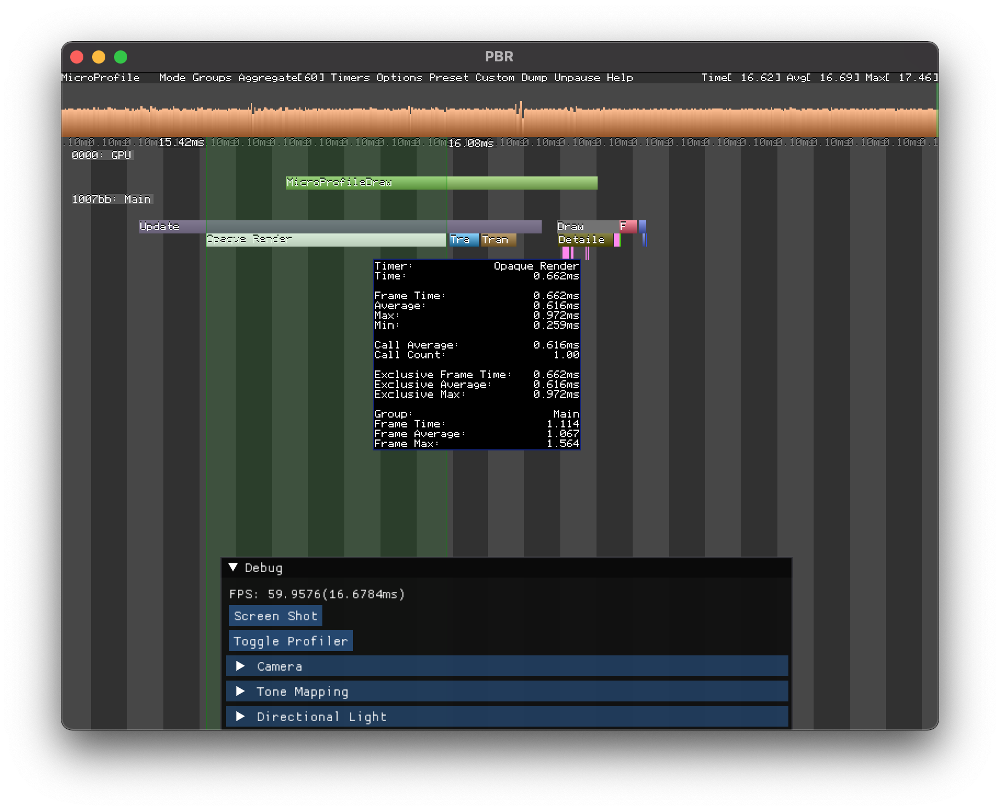

# OpenGL简介

2021&2022年春季学期北京大学本科生图形学课程的样例代码。


## 功能

+ 基础PBR
+ [GLTF](https://github.com/KhronosGroup/glTF) 模型加载
+ 截图
+ [ImGui](https://github.com/ocornut/imgui) 集成
+ [Microprofile](https://github.com/zeux/microprofile) 集成
  

## Download

```
git clone https://github.com/huisedenanhai/ogl-intro.git
```

## Build

本项目利用[CMake](https://cmake.org/)配置。

### CLion

直接打开文件夹即可。

### VS Code

安装插件

+ [CMake Tools](https://vector-of-bool.github.io/docs/vscode-cmake-tools/)
+ [C/C++](https://marketplace.visualstudio.com/items?itemName=ms-vscode.cpptools)

然后打开文件夹即可。

### Visual Studio

1. 安装[CMake](https://cmake.org/)
2. 打开CMake
3. 选择项目文件夹和输出文件夹
4. 点击Configure
5. Configure结束后点击Generate
6. 打开输出文件夹中的ogl-intro.sln

### Xcode

1. 安装[CMake](https://cmake.org/)
2. 运行如下指令

```bash
cd ogl-intro
mkdir build
cd build
cmake .. -G Xcode
open ogl-intro.xcodeproj
```

## FQA

### Building on Linux

如果在Linux编译时报错，例如缺少`GL/glu.h`，可能需要手动安装[OpenGL相关依赖](https://www.khronos.org/opengl/wiki/Getting_Started)：

```bash
sudo apt-get update
sudo apt-get install libglu1-mesa-dev freeglut3-dev mesa-common-dev
```

如果在编译glfw过程中提示缺少`lib***`， 需要手动安装[GLFW依赖](https://www.glfw.org/docs/3.3/compile).
